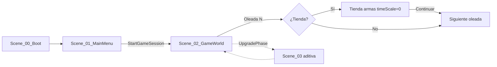

# Mutation Swarm 2D — Documentación completa del proyecto

> Documento de referencia con **todo lo implementado hasta la fecha** en el repositorio `Mutation2D`.  
> Última revisión alineada con Unity **6000.3.8f1** y el estado del código en `Assets/`.

---

## Tabla de contenidos

1. [Resumen ejecutivo](#1-resumen-ejecutivo)
2. [Stack técnico](#2-stack-técnico)
3. [Concepto y narrativa](#3-concepto-y-narrativa)
4. [Estructura del repositorio](#4-estructura-del-repositorio)
5. [Escenas y flujo de juego](#5-escenas-y-flujo-de-juego)
6. [Sistemas de gameplay](#6-sistemas-de-gameplay)
7. [Catálogo de scripts](#7-catálogo-de-scripts)
8. [Event Bus](#8-event-bus)
9. [ScriptableObjects y datos](#9-scriptableobjects-y-datos)
10. [Prefabs](#10-prefabs)
11. [Arte y assets visuales](#11-arte-y-assets-visuales)
12. [Armas y tienda](#12-armas-y-tienda)
13. [UI](#13-ui)
14. [Herramientas de editor y build](#14-herramientas-de-editor-y-build)
15. [Integración AI Studio (CCGS + Cursor)](#15-integración-ai-studio-ccgs--cursor)
16. [Documentación de diseño](#16-documentación-de-diseño)
17. [Controles](#17-controles)
18. [Capas físicas](#18-capas-físicas)
19. [Estado por sistema](#19-estado-por-sistema)
20. [Pendiente y roadmap](#20-pendiente-y-roadmap)
21. [Comandos rápidos](#21-comandos-rápidos)

---

## 1. Resumen ejecutivo

**Mutation Swarm 2D** es un survival horde shooter cooperativo (1–4 jugadores) en una arena 2D fija. La premisa distintiva es que los enemigos **evolucionan entre oleadas** mediante un sistema genético (`Genome`) que responde al estilo de juego del escuadrón.

| Aspecto | Detalle |
|---------|---------|
| Motor | Unity 6000.3.8f1 |
| Render | 2D URP |
| Lenguaje | C# |
| UI | UI Toolkit (HUD, tienda) + uGUI Kenney (menú) |
| Repo | `Illanes09/Mutation2D-Final` (referencia en `AGENTS.md`) |
| Ejecutable | `Builds/Windows/MutationSwarm.exe` vía `build.ps1` |

---

## 2. Stack técnico

| Componente | Versión / nota |
|------------|----------------|
| Unity Editor | `6000.3.8f1` (`ProjectSettings/ProjectVersion.txt`) |
| Input | Unity Input System (`Keyboard`, gamepad en menús) |
| Pooling | `Script_04_ObjectPool` + `SO_PoolConfig` |
| Persistencia | `Script_05_SaveManager` (PlayerPrefs + JSON) |
| Namespaces | `MutationSwarm.Core`, `.Entities`, `.Combat`, `.Evolution`, `.Building`, `.UI`, `.Meta`, `.Editor` |

**Convenciones de código (obligatorias):**

- Scripts: `Script_XX_NombreDescriptivo.cs`
- Escenas: `Scene_XX_Nombre.unity`
- Comunicación gameplay ↔ UI: **`Script_03_EventBus`** (no `FindObjectOfType` para lógica cruzada)
- Balance en `ScriptableObject`, no números mágicos en runtime de gameplay
- Singletons de sesión: `Script_01_GameManager` con `DontDestroyOnLoad` donde corresponda

---

## 3. Concepto y narrativa

### Elevator pitch

En el sector de investigación **Argos-9**, una colonia de organismos sintéticos escapó del laboratorio. El enjambre muta en tiempo real, hereda rasgos y aprende de cada táctica humana. El escuadrón (1–4 jugadores) debe resistir oleadas, adaptarse más rápido que la plaga y sobrevivir a la **Reina Evolutiva**.

### Pilares de diseño

| Pilar | Implementación |
|-------|------------------|
| Presión evolutiva | `Script_07`–`Script_10`, tinte visual en `Script_13` |
| Oleadas escalables | `Script_02_WaveManager`, `SO_WaveConfig` |
| Coop 1–4 | `Script_01_GameManager`, multi-input base |
| Construcción táctica | `Script_23`, torretas/barricadas, `Scene_03` (parcial) |
| Legibilidad | HUD, toasts de mutación, formas distintas por tipo de enemigo |

Fuente: `design/game-concept.md`, `design/game-pillars.md`.

---

## 4. Estructura del repositorio

```
Mutation2D/
├── Assets/
│   ├── _Art/              Sprites, animaciones, Kenney UI, GunsPack, Materials
│   ├── _Audio/            Music, SFX (estructura)
│   ├── _Data/             Catálogos (ART_PACKAGE_CATALOG.md)
│   ├── _Prefabs/          Player, Enemies, Projectiles, Structures, UI, VFX
│   ├── _Scenes/           Scene_00 … Scene_03
│   ├── _ScriptableObjects/ Waves, Combat, Building, Pools, Evolution, Audio
│   └── _Scripts/          Código runtime + Editor
├── Builds/Windows/        Salida de build (MutationSwarm.exe)
├── design/                GDDs, art bible, specs de entidades
├── docs/                  Integración CCGS, esta documentación
├── production/            Etapas CCGS (si aplica)
├── Logs/                  Logs de batchmode Unity
├── .cursor/               Rules + skills para Cursor
├── AGENTS.md              Contexto para agentes IA
├── README.md              Guía rápida de uso en Unity
└── build.ps1              Pipeline contenido + exe Windows
```

### Carpetas de código (`Assets/_Scripts/`)

| Carpeta | Contenido |
|---------|-----------|
| `Core/` | GameManager, oleadas, EventBus, pool, save, input, boot, audio, parallax, factories de sprites |
| `Evolution/` | Motor evolutivo, genome, selección, presión adaptativa |
| `Entities/` | Jugador, enemigos base, FSM, variantes (Boss, Queen, Mimic, Parasite) |
| `Combat/` | Proyectiles, armas, daño, estados, loadout, tienda |
| `Building/` | BuildManager, estructuras, torreta, barricada |
| `UI/` | HUD, menús, Kenney uGUI, tienda de armas (UXML/USS) |
| `Meta/` | Ecosistema global, analytics (stubs) |
| `Editor/` | Setup de proyecto, import de armas, arte jugador/enemigos, build batch |

---

## 5. Escenas y flujo de juego

| Escena | Archivo | Rol |
|--------|---------|-----|
| Boot | `Scene_00_Boot.unity` | Singletons: GameManager, Input, Save, Audio |
| Menú | `Scene_01_MainMenu.unity` | Inicio, 1–4 jugadores, opciones (Kenney uGUI) |
| Arena | `Scene_02_GameWorld.unity` | Juego principal: oleadas, HUD, tienda, bootstrap |
| Upgrade | `Scene_03_UpgradeMenu.unity` | Mejoras aditivas entre oleadas (conexión parcial) |

### Flujo ideal



### Flujo actual implementado

1. **Boot** → carga sistemas persistentes.
2. **MainMenu** → `Script_30_MainMenuController` / `Script_33_KenneyMainMenuUGUI` → `Script_01_GameManager.StartGameSession(playerCount)`.
3. **GameWorld** → `Script_32_GameplayBootstrap` puede auto-iniciar oleada 1 (`_autoStartWave`).
4. **Fin de oleada** → `WaveEndedEvent` → `Script_39_WeaponShopManager` abre tienda o llama `StartNextWave()` directamente.
5. **Scene_03** → `WaveManager.EnterUpgradePhase()` existe pero el loop completo menú-upgrade-oleada aún no está cerrado al 100%.

---

## 6. Sistemas de gameplay

### 6.1 Sesión global (`Script_01_GameManager`)

- Estado de partida, número de jugadores coop, multiplicador de enemigos coop.
- Game over y reinicio de sesión.
- Punto de entrada desde menú.

### 6.2 Oleadas (`Script_02_WaveManager`)

- Estados: `Waiting`, `Spawning`, `Active`, `Evolution`, `UpgradePhase`.
- Spawnea enemigos en `_spawnPoints` con intervalo configurable (`SO_WaveConfig` o valores serializados).
- Publica `WaveStartedEvent`, `WaveEndedEvent`, cuenta vivos/muertos.
- Al matar enemigos: `Script_23_BuildManager.AddMaterials(1–3)` materiales aleatorios.
- Métodos: `StartWave()`, `StartNextWave()`, `EnterUpgradePhase()`, `ExitUpgradePhase()`.

### 6.3 Evolución (`Script_07`–`Script_10`)

| Script | Función |
|--------|---------|
| `Script_07_EvolutionEngine` | Procesa combate de la oleada y genera siguiente generación |
| `Script_08_Genome` | Genes: velocidad, tamaño, salto, armadura, veneno, explosión, regeneración, visión, grupal, resistencias, espinas |
| `Script_09_SelectionAlgorithm` | Torneo + elitismo |
| `Script_10_AdaptivePressure` | Contraestrategia según comportamiento del jugador |

**Visual de mutación:** `Genome.GetMutationColor()` + escala/tinte en `Script_13_EnemyBase` (sin redibujar sprite por gen).

Colores dominantes por gen (referencia):

| Gen dominante | Color aproximado |
|---------------|------------------|
| Veneno | Verde |
| Velocidad | Rojo |
| Armadura / resistencias | Azul |
| Salto / grupal | Amarillo |
| Regeneración | Púrpura |
| Explosión / espinas | Oscuro |

### 6.4 Jugador (`Script_11`, `Script_12`, `Script_38`)

- Movimiento: WASD, coyote time, jump buffer, dash, wall jump (flags en stats).
- Animator: parámetros `Speed`, `IsGrounded`, `IsJumping`, `Dash`, etc. (`AC_Player`).
- Combate: dispara vía `Script_20_WeaponBase` referenciado en controller; el loadout asigna el arma activa con `SetPrimaryWeapon()`.
- **`Script_38_PlayerLoadout`:** armas poseídas, compra con materiales, equipa `Script_20_WeaponGun` con sprite del pack.

### 6.5 Enemigos (`Script_13`–`Script_18`)

| Tipo | Script | Prefab | Silueta (art bible) |
|------|--------|--------|---------------------|
| Drone | `Script_13` + FSM | `Prefab_Enemy_Drone` | Círculo + antenas |
| Boss | `Script_15` | `Prefab_Enemy_Boss` | Cuadrado grande |
| Queen | `Script_16` | `Prefab_Enemy_Queen` | Disco + corona |
| Mimic | `Script_17` | `Prefab_Enemy_Mimic` | Cuadrado “glitch” |
| Parasite | `Script_18` | `Prefab_Enemy_Parasite` | Triángulo |
| Prototipo geo | — | `Prefab_Enemy_Geo` | Círculo rojo Kenney |

- **FSM** (`Script_14`): `Idle`, `Pursue`, `Attack`, `Flee`, `Swarm`.
- Detección: `Physics2D.OverlapCircle` (sin triggers para visión).
- Sprites generados por `EnemySpriteFactory` (64×64, pixel art procedural).

### 6.6 Combate

| Script | Rol |
|--------|-----|
| `Script_19_Projectile` | Proyectil pooled; `Configure(damage, speed, lifetime, sprite)` |
| `Script_20_WeaponBase` | Cadencia, fire point, pool key |
| `Script_20_WeaponGun` | Arma del pack Guns V1.01 |
| `Script_20_WeaponBasic` | Rifle geométrico legacy (`Projectile_Geo`) |
| `Script_21_DamageSystem` | Daño y resistencias |
| `Script_22_StatusEffects` | Poison, freeze, burn, stun |

### 6.7 Construcción (`Script_23`, `Script_24`)

- Materiales de build (no persisten entre sesiones: `ResetMaterialsForNewSession`).
- Fase de construcción ligada a `UpgradePhase`.
- Estructuras: torreta (`TurretStructure`), barricada (`BarricadeStructure`).
- SO: torreta, barricada, plataforma, mina.

### 6.8 Pooling (`Script_04`)

- Pools por `SO_PoolConfig` (clave + prefab + tamaños).
- Pools de proyectiles por arma y `Projectile_Geo` / `Projectile_Basic`.

### 6.9 Meta (stubs)

- `Script_28_GlobalEcosystem`
- `Script_29_AnalyticsLogger`

---

## 7. Catálogo de scripts

### Core

| Script | Descripción |
|--------|-------------|
| `Script_00_BootLoader` | Carga inicial de escenas |
| `Script_01_GameManager` | Sesión global, coop, game over |
| `Script_02_WaveManager` | Oleadas y fases |
| `Script_03_EventBus` | Bus tipado + structs de eventos |
| `Script_04_ObjectPool` | Pool de GO |
| `Script_05_SaveManager` | Guardado |
| `Script_06_InputManager` | Input 1–4 jugadores |
| `Script_AudioManager` | Audio (stub/base) |
| `Script_31_ParallaxLayer` | Parallax de fondo |
| `Script_32_GameplayBootstrap` | Auto-start oleada en Scene_02 |
| `Script_SpawnPointGizmos` | Gizmos de spawn en editor |
| `EnemySpriteFactory` | Generación procedural sprites enemigos |
| `GeometricSpriteFactory` | Sprites geo (círculo, cuadrado, triángulo) |

### Evolution

| Script | Descripción |
|--------|-------------|
| `Script_07_EvolutionEngine` | Motor evolutivo |
| `Script_08_Genome` | ADN enemigo |
| `Script_09_SelectionAlgorithm` | Selección |
| `Script_10_AdaptivePressure` | Presión adaptativa |

### Entities

| Script | Descripción |
|--------|-------------|
| `Script_11_PlayerController` | Movimiento + disparo + animator |
| `Script_12_PlayerStats` | HP, velocidad, dash, flags |
| `Script_13_EnemyBase` | Genome, combate, muerte |
| `Script_14_EnemyStateMachine` | FSM |
| `Script_15_EnemyBoss` | Boss |
| `Script_16_EnemyQueen` | Reina |
| `Script_17_EnemyMimic` | Mimic |
| `Script_18_EnemyParasite` | Parásito |

### Combat + Building

| Script | Descripción |
|--------|-------------|
| `Script_19_Projectile` | Proyectil |
| `Script_20_WeaponBase` / `WeaponGun` / `WeaponBasic` | Armas |
| `Script_21_DamageSystem` | Daño |
| `Script_22_StatusEffects` | Estados alterados |
| `Script_38_PlayerLoadout` | Inventario y equipamiento |
| `Script_39_WeaponShopManager` | Tienda entre oleadas |
| `Script_23_BuildManager` | Construcción + materiales |
| `Script_24_StructureBase` | Base estructuras |
| `TurretStructure` | Torreta automática |
| `BarricadeStructure` | Barricada con HP |

### UI

| Script | Descripción |
|--------|-------------|
| `Script_25_HUDController` | HUD + toasts + arma equipada |
| `Script_26_UpgradeMenuUI` | Cartas de mejora |
| `Script_27_EvolutionDisplayUI` | Panel genético |
| `Script_30_MainMenuController` | Menú UI Toolkit |
| `Script_33_KenneyMainMenuUGUI` | Menú Kenney uGUI |
| `Script_40_WeaponShopUI` | Tienda de armas |
| `KenneyUIPaths` | Rutas de sprites Kenney |

### Editor (solo Unity Editor)

| Script | Menú / uso |
|--------|------------|
| `MutationSwarmProjectSetup` | Setup Complete Project |
| `MutationSwarmKenneyGameplaySetup` | Kenney UI + nivel geo |
| `MutationSwarmGunsImport` | Import Guns + tienda |
| `MutationSwarmPlayerArtSetup` | Jugador Argos armor |
| `MutationSwarmPlayerAnimatorSetup` | Clips animator jugador |
| `MutationSwarmEnemyArtSetup` | Sprites enemigos art bible |
| `MutationSwarmArtLevelBuilder` | Import art pack + nivel Scene_02 |
| `MutationSwarmBatchBuild` | Entry points batchmode |
| `BuildPipeline` / `MutationSwarmBuildPipeline` | Build contenido y Windows |
| `PlayerSpriteProcessing` | Recorte y quitar fondo jugador |
| `PlayerWalkFrameGenerator` | Frames walk procedural |

---

## 8. Event Bus

Todos en `Script_03_EventBus.cs`:

| Evento | Campos / uso |
|--------|----------------|
| `WaveStartedEvent` | `waveNumber` |
| `WaveEndedEvent` | `waveNumber`, `summary` |
| `EnemySpawnedEvent` | `enemy` |
| `EnemyDiedEvent` | `enemy`, `combatData` |
| `EnemyCountChangedEvent` | `alive`, `total` |
| `EvolutionPhaseEvent` | `summary` |
| `UpgradePhaseEvent` | — |
| `PlayerHitEvent` | `playerIndex`, `damage` |
| `BossSpawnEvent` | `bossData` |
| `BuildMaterialsChangedEvent` | `materials` |
| `BuildPhaseTimerEvent` | `timeRemaining` |
| `MutationToastEvent` | `message`, `color` |
| `WeaponShopOpenedEvent` | `afterWave` |
| `WeaponShopClosedEvent` | — |
| `WeaponPurchasedEvent` | `weapon` |
| `WeaponEquippedEvent` | `weapon` |

---

## 9. ScriptableObjects y datos

### Tipos C# (definiciones)

| Archivo | Tipo |
|---------|------|
| `SO_WaveConfig.cs` | Config oleadas |
| `SO_PoolConfig.cs` | Pool |
| `SO_WeaponData.cs` | Arma (stats, sprites, coste) |
| `SO_UpgradeData.cs` | Mejoras |
| `SO_StructureData.cs` | Estructuras |
| `SO_Genome_Base.cs` | Genoma base |
| `SO_AudioData.cs` | Audio |

### Assets generados (ejemplos)

**Oleadas:** `SO_WaveConfig_Default.asset`

**Armas** (`Assets/_ScriptableObjects/Combat/Weapons/`):

| Asset | ID | Coste materiales |
|-------|-----|------------------|
| `SO_Weapon_glock_p80` | glock_p80 | 0 (inicial) |
| `SO_Weapon_revolver_colt` | revolver_colt | 18 |
| `SO_Weapon_mp5a3` | mp5a3 | 35 |
| `SO_Weapon_ak47` | ak47 | 50 |
| `SO_Weapon_bazooka_m20` | bazooka_m20 | 75 |
| `SO_Weapon_bazooka_thick` | bazooka_thick | 110 |

**Upgrades:** Vampirism, ElectricAmmo, ExplosiveDash, TempShield, Drone, FollowTurret, Pierce, Regen, etc.

**Estructuras:** Turret, Barricade, Platform, Mine.

**Pools:** `SO_Pool_Projectile_*` por cada arma + `Projectile_Geo`, `Projectile_Basic`.

---

## 10. Prefabs

### Jugador

| Prefab | Uso |
|--------|-----|
| `Prefab_Player` | Sprite Argos armor + Animator + `Script_38_PlayerLoadout` |
| `Prefab_Player_Geo` | Variante geométrica azul (prototipo Kenney) |

Jerarquía típica: `GroundCheck`, `FirePoint`, componentes físicos 2D.

### Enemigos

`Prefab_Enemy_Drone`, `Boss`, `Queen`, `Mimic`, `Parasite`, `Prefab_Enemy_Geo`.

### Proyectiles

`Prefab_Projectile_Basic`, `Prefab_Projectile_Geo`, `Prefab_Projectile_{weaponId}` (uno por arma importada).

### Estructuras

`Prefab_Structure_Turret`, `Prefab_Structure_Barricade`.

### Escena GameWorld

- Objeto `_WeaponShop` con `Script_39_WeaponShopManager`, `Script_40_WeaponShopUI`, `UIDocument` → `WeaponShop.uxml` + `WeaponShop.uss`.

---

## 11. Arte y assets visuales

### 11.1 Jugador — Power armor Argos-9

| Asset | Descripción |
|-------|-------------|
| `Spr_Player_ArgosArmor_source.png` | Imagen de referencia (usuario) |
| `Spr_Player_ArgosArmor_sheet.png` | Spritesheet 2 idle + 8 walk, sin fondo |
| `Spr_Player_ArgosArmor.png` | Sprite principal |
| `AC_Player.controller` | Idle, Walk, Fall, Jump, Dash, Attack, Hit, Die |

**Enfoque de animación:** **spritesheet pintado + Unity Animator** (generado por editor: `PlayerWalkFrameGenerator`, `MutationSwarmPlayerArtSetup`). No hay rig de huesos 2D Animation en el proyecto actual.

Menú: **`Tools → Mutation Swarm → Build Player Sprite (Argos Armor)`**

### 11.2 Enemigos — Art bible

Sprites 64×64 en `Assets/_Art/Sprites/Enemies/` generados por `EnemySpriteFactory`.

Menú: **`Tools → Mutation Swarm → Build Enemy Sprites (Art Bible)`**

Specs: `design/assets/specs/enemy_*.md`

**Animación enemigos:** actualmente **sprite estático** + flip X + **tinte/escala por mutación** (`GetMutationColor`). La carpeta `Assets/_Art/Animations/Enemies/` existe pero **sin controllers completos** — mejora pendiente (spritesheet por tipo o 2D Animation).

### 11.3 Paleta visual (objetivo)

| Rol | Referencia |
|-----|------------|
| Jugador | Cian/azul Argos (`#33BFFF` aprox.) |
| Enemigo base | Rojo legible |
| Mutación | Verde (veneno) y púrpura (regeneración) + tinte runtime |
| Entorno | Pack `Assets/_Art/Materials` + Kenney amarillo |
| UI | Kenney Blue/Green/Yellow/Extra (no Grey/Red en menú principal) |

Ver `design/art/art-bible.md`.

### 11.4 Otros packs

| Pack | Ruta |
|------|------|
| Kenney UI Space Expansion | `Assets/_Art/kenney_ui-pack-space-expansion/` |
| Guns Update V1.01 | `Assets/_Art/GunsPack/Guns_V1.01 - Commission - Copy/` |
| Materials (fondos, tiles) | `Assets/_Art/Materials/` |
| Sprites geo generados | `Assets/_Art/Sprites/Generated/` |

Catálogo detallado: `Assets/_Data/ART_PACKAGE_CATALOG.md`

---

## 12. Armas y tienda

### Importación

**`Tools → Mutation Swarm → Import Guns Pack + Weapon Shop`**

- Configura texturas del pack como sprites (PPU 32, Point).
- Crea `SO_Weapon_*`, prefabs de proyectil, entradas de pool.
- Crea/actualiza `_WeaponShop` en `Scene_02_GameWorld`.
- Conecta `Script_38_PlayerLoadout` en prefabs de jugador (arma inicial: Glock).

### Tienda (`Script_39`, `Script_40`)

- Se abre tras oleadas **2, 5, 8, 11, 14** y cada **3ª oleada** (3, 6, 9…).
- Configurable: `_shopAfterWaves`, `_alsoOnEveryThirdWave`.
- Pausa: `Time.timeScale = 0`.
- Pago: materiales de `Script_23_BuildManager`.
- Cerrar: botón **Continuar** o **Esc** → `StartNextWave()`.
- Si no toca tienda: **siguiente oleada automática** (sin quedarse bloqueado).

### Stats de armas (import)

| Arma | fireRate | damage | speed proyectil |
|------|----------|--------|-----------------|
| Glock P80 | 0.22 | 9 | 15 |
| Revolver | 0.55 | 24 | 16 |
| MP5 | 0.09 | 7 | 14 |
| AK-47 | 0.11 | 13 | 18 |
| Bazooka | 1.1 | 48 | 9 |
| Thick Bazooka | 1.4 | 72 | 8 |

---

## 13. UI

### UI Toolkit

| Archivo | Uso |
|---------|-----|
| `HUD_Main.uxml` / `HUD_Main.uss` | HUD partida |
| `BuildRadialMenu.uxml` / `.uss` | Menú radial construcción |
| `UpgradeMenu.uxml` | Mejoras |
| `WeaponShop.uxml` / `WeaponShop.uss` | Tienda de armas |
| `MainMenu.uxml` / `.uss` | Menú (variante toolkit) |

### uGUI Kenney

`Script_33_KenneyMainMenuUGUI` — botones y paneles del menú principal con sprites Blue/Green.

---

## 14. Herramientas de editor y build

### Menús Unity (`Tools → Mutation Swarm`)

| Comando | Función |
|---------|---------|
| Setup Complete Project | Escenas, prefabs base, SO, capas, build settings |
| Build Kenney UI + Playable Geometric Level | Menú + Scene_02 geo jugable |
| Import Guns Pack + Weapon Shop | Armas + tienda |
| Build Player Sprite (Argos Armor) | Spritesheet y animator jugador |
| Build Enemy Sprites (Art Bible) | 5 tipos de enemigo |
| Import Art Package Settings | PNG → sprites PPU 16 |
| Build Art Level (Scene_02) | Parallax, plataformas, decoración |
| Build All Content (Kenney + Scenes) | Pipeline contenido |
| Build Windows / Build Windows (Release) | Ejecutable |

### Batchmode (`build.ps1`)

1. Cierra Unity si está abierto.
2. `MutationSwarmBatchBuild.RunContentOnly` → guns + enemigos + jugador + Kenney.
3. `MutationSwarmBatchBuild.RunWindowsOnly` → `Builds/Windows/MutationSwarm.exe`.

Logs: `Logs/batch-content.log`, `Logs/batch-windows.log`, `Logs/batch-guns.log`.

---

## 15. Integración AI Studio (CCGS + Cursor)

Adaptación de [Claude Code Game Studios](https://github.com/Donchitos/Claude-Code-Game-Studios):

| Recurso | Ubicación |
|---------|-----------|
| Contexto agentes | `AGENTS.md` |
| Reglas | `.cursor/rules/*.mdc` |
| Skills | `.cursor/skills/mutation-*`, `ccgs-help` |
| Diseño | `design/` |
| Guía integración | `docs/CCGS-INTEGRATION.md` |
| Template referencia | `_ccgs-template/` (gitignored) |

### Skills Cursor

| Skill | Propósito |
|-------|-----------|
| `mutation-start` | Onboarding |
| `mutation-project-stage` | Auditoría GDD vs código |
| `mutation-balance-check` | Balance oleadas/genoma/daño |
| `mutation-build` | Build + exe |
| `mutation-visual-art` | Sprites, animator, art bible |
| `ccgs-help` | Índice workflows CCGS |

### Roles mentales (referencia)

creative-director, game-designer, unity-specialist, gameplay-programmer, qa-tester, art-director, technical-artist.

---

## 16. Documentación de diseño

```
design/
├── game-concept.md
├── game-pillars.md
├── systems-index.md
├── art/art-bible.md
├── gdd/
│   ├── wave-system.md
│   └── evolution-system.md
└── assets/
    ├── entity-inventory.md
    └── specs/
        ├── char_player_argos.md
        ├── enemy_drone.md
        ├── enemy_boss.md
        ├── enemy_queen.md
        ├── enemy_mimic.md
        └── enemy_parasite.md
```

---

## 17. Controles

| Acción | Tecla / input |
|--------|----------------|
| Movimiento | WASD / flechas |
| Salto | Espacio |
| Dash | Shift |
| Disparar | Clic / RT (gamepad) |
| Cerrar tienda | Esc o Continuar |

*(Multi-jugador: base en `Script_06`; asignación completa por jugador según configuración de Input Manager.)*

---

## 18. Capas físicas

Definidas en setup del proyecto:

`Player`, `Enemy`, `Projectile_Player`, `Projectile_Enemy`, `Platform`, `BuildSurface`, `Structure`.

---

## 19. Estado por sistema

| Sistema | Estado | Notas |
|---------|--------|-------|
| Boot / GameManager | ✅ Implementado | |
| Oleadas | ✅ Implementado | Auto-start en bootstrap |
| Evolución / Genome | ✅ Implementado | Visual por tinte |
| Jugador movimiento | ✅ Implementado | Animator Argos |
| Enemigos + FSM | ✅ Implementado | 5 tipos + geo |
| Combate / pooling | ✅ Implementado | |
| Armas pack + tienda | ✅ Implementado | 6 armas |
| HUD / toasts | ✅ Parcial | Muestra arma equipada |
| Kenney menú + nivel geo | ✅ Implementado | |
| Construcción Scene_03 | ⚠️ Parcial | Falta cerrar loop con WaveManager |
| Upgrade menu UI | ⚠️ Parcial | Escena existe |
| Audio | ⚠️ Stub | `Script_AudioManager` |
| Meta / analytics | ⚠️ Stub | |
| Animaciones enemigos | ❌ Pendiente | Solo sprite estático + mutación |
| Boss/Queen en oleadas especiales | ⚠️ Parcial | Prefabs listos; spawn rules a definir |
| Coop 2–4 completo | ⚠️ Parcial | Base presente |

Fuente cruzada: `design/systems-index.md`.

---

## 20. Pendiente y roadmap

### Prioridad alta

1. Cerrar flujo `WaveManager` ↔ `BuildManager.StartBuildPhase()` ↔ carga aditiva `Scene_03_UpgradeMenu`.
2. Spawn de Boss/Queen/Mimic/Parasite en oleadas específicas (no solo Drone).
3. **Animaciones enemigos** alineadas con paleta jugador + tintes verde/morado en mutación (spritesheet por tipo recomendado para este pipeline procedural).

### Prioridad media

4. Pulir orientación de sprites de armas (pack side-view).
5. Balance de materiales vs precios de tienda.
6. Completar clips Jump/Dash/Attack del jugador (más frames en sheet).
7. Audio real con `SO_AudioData`.

### Animación: spritesheet vs 2D Animation (huesos)

| Enfoque | En este proyecto |
|---------|------------------|
| **Spritesheet + Animator** | ✅ Usado para jugador; mejor encaje con `EnemySpriteFactory` y generación por código |
| **Unity 2D Animation (bones)** | No implementado; útil si se importa arte con rig desde Aseprite/Spine |

Recomendación documentada: mantener **spritesheet** para enemigos generados y mutación por **MaterialPropertyBlock / color**; huesos solo si el arte final viene ya riggeado.

---

## 21. Comandos rápidos

### PowerShell — build completo

```powershell
cd C:\Game\Mutation2D
.\build.ps1
```

### Unity batch — solo armas

```powershell
& "C:\Program Files\Unity\Hub\Editor\6000.3.8f1\Editor\Unity.exe" `
  -batchmode -quit -nographics `
  -projectPath "C:\Game\Mutation2D" `
  -executeMethod MutationSwarm.Editor.MutationSwarmGunsImport.ImportAll `
  -logFile "C:\Game\Mutation2D\Logs\batch-guns.log"
```

### Primer uso en editor

1. Abrir proyecto en Unity 6000.3.8f1.
2. `Tools → Mutation Swarm → Setup Complete Project` (si escenas vacías).
3. `Tools → Mutation Swarm → Build All Content` o ejecutar pasos individuales del README.
4. Play en `Scene_02_GameWorld` o flujo completo desde `Scene_00_Boot`.

---

## Referencias cruzadas

- Guía rápida: [`README.md`](../README.md)
- Agentes IA: [`AGENTS.md`](../AGENTS.md)
- CCGS: [`docs/CCGS-INTEGRATION.md`](CCGS-INTEGRATION.md)
- Índice sistemas: [`design/systems-index.md`](../design/systems-index.md)

---

*Documento generado para consolidar el estado del proyecto Mutation Swarm 2D. Actualizar cuando se añadan sistemas mayores (animaciones enemigo, Scene_03 completo, audio).*
